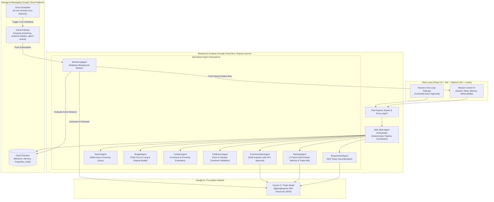

# Agentic Housing Navigator — Architecture Document

## 1. System Architecture Diagram

---

## 2. Component Details

### 2.1 Client Layer
- **Framework:** React 18 with Vite, TypeScript, and Tailwind CSS.
- **Components:**
  - `CreateMissionPage`: Natural language parsing with interactive prompt presets.
  - `ActiveMissionPage`: Live multi-agent execution pipeline with 8-stage progress tracker.
  - `PropertyCard`: Transparent match score badges, rent breakdown, commute metrics, and trade-off tags.
  - `AgentApprovalModal`: Human-in-the-loop authorization modal with draft editing.
  - `PreferencesPage`: Interactive cross-session memory management.
  - `ActivityPage`: Real-time OpenTelemetry trace logs and JSON export.
  - `HackathonDemoBar`: Persistent judge demo banner with step-by-step guidance.

### 2.2 Server & Compute Layer (Google Cloud Run)
- **Runtime:** Node.js Express server configured on port 3000.
- **Responsibilities:**
  - Proxies requests to `@google/genai` to safeguard API keys.
  - Hosts the Multi-Agent Orchestrator and specialized agent workers.
  - Serves compiled static frontend assets with SPA fallback.
  - Implements graceful shutdown (`SIGTERM`/`SIGINT`) for zero-downtime container updates.

### 2.3 Persistence Layer (Google Cloud Firestore)
- **Repositories:**
  - `FirestoreUserRepository`: User credentials and profiles.
  - `FirestoreMissionRepository`: Search missions and criteria.
  - `FirestorePropertyRepository`: Rental property inventory and verified listings.
  - `FirestoreMemoryRepository`: Long-term user lifestyle preferences.
  - `FirestoreShortlistRepository`: Saved properties and user notes.
  - `FirestoreNotificationRepository`: In-app alert notifications.
  - `FirestoreEventRepository`: Telemetry spans, audit logs, and agent execution records.
  - `FirestoreApprovalRepository`: Pending and resolved human-in-the-loop approval requests.
  - `FirestoreMonitoringJobRepository`: Active background monitoring schedules.

### 2.4 Messaging Layer (Google Cloud Pub/Sub & Cloud Scheduler)
- **Topics:**
  - `housing-monitoring`: Heartbeats dispatched by Cloud Scheduler every 15 minutes.
  - `property-updates`: Real-time ingestion events for new rental listings.
  - `agent-events`: Telemetry event bus for system auditing.
