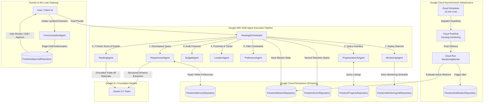

# 🏠 Agentic Housing Navigator

> **Autonomous, Multi-Agent Real Estate Mission Control Powered by Google Cloud, Google ADK & Gemini 3.7 Flash**

[](https://cloud.google.com)
[](https://ai.google.dev)
[](https://www.typescriptlang.org/)
[](https://react.dev)
[](https://vitejs.dev/)

---

## 1. Overview

**Agentic Housing Navigator** is an autonomous real estate navigation system that converts natural-language housing requirements into proactive, multi-agent missions. Built on Google Cloud and the Google Agent Development Kit (ADK) pattern, the platform operates continuously to evaluate listings, calculate multi-factor affordability and commute metrics, maintain cross-session user memory, and run background monitoring for new inventory.

### What Problem It Solves
Finding rental housing is traditionally a tedious, manual chore. Renters spend weeks juggling conflicting constraints across budget, commute distance, floor levels, furnishing, and hidden utility costs while constantly refreshing listing portals.

### Why Traditional Housing Search Is Inefficient
- **Keyword & Filter Bottlenecks:** Traditional portals rely on rigid, shallow filters that cannot capture nuanced requirements (e.g., *"avoid ground floor, need power backup for remote work, max 20-min commute to campus"*).
- **Manual Repetition:** Users must repeatedly run identical searches across multiple days to catch newly added listings.
- **Hidden Trade-offs:** Portals display basic rent but obscure total cost of living (maintenance, security deposits, utility estimates).
- **Stateless & Forgetful:** Every search session starts from scratch with zero memory of user lifestyle constraints or past decisions.

### How the Autonomous Agent Approach Is Different
Instead of requiring manual filtering, the system acts as an autonomous delegate. The user expresses a single high-level housing goal. A coordinated network of specialized agents decomposes the goal, queries the inventory, conducts deterministic financial and spatial audits, scores candidates, persists user lifestyle preferences, and deploys a background monitoring daemon to alert the user when new matching listings appear.

### Who Benefits
- **Students & University Staff:** Finding verified accommodations near campus within strict student budgets.
- **Relocating Professionals:** Seeking specific lifestyle amenities (high-speed internet, power backup, parking, higher floors) near tech corridors.
- **Busy Renters:** Anyone who wants an autonomous agent to handle repetitive market scanning and trade-off analysis.

---

## 2. Problem Statement

Renting a home involves high-dimensional decision-making with competing constraints:

1. **Finding Suitable Properties:** Sorting through hundreds of unvetted listings to find units that match exact structural criteria.
2. **Budget Constraints & Hidden Costs:** Monthly rent alone does not reflect true move-in expenses (security deposits, maintenance surcharges, utility bills).
3. **Location & Commute Requirements:** Proximity is often measured in straight-line distance rather than realistic transit time (walking, two-wheeler, cab).
4. **Complex Lifestyle Preferences:** Constraints like floor preference (avoiding damp/noisy ground floors), dedicated vehicle parking, and pet friendliness are rarely filterable together.
5. **Multi-Property Comparison:** Comparing trade-offs between 3–5 properties across rent, distance, furnishing, and amenities is mentally exhausting.
6. **Continuous Market Checking:** High-demand properties get leased quickly; renters must constantly refresh portals.
7. **Repetitive Manual Work:** Repeating the same manual search, evaluation, and landlord inquiry drafting over and over.

---

## 3. Solution

Agentic Housing Navigator transforms a high-level natural language prompt into an autonomous, 8-stage verifiable pipeline:

```
User Goal
   ↓
Requirement Understanding (RequirementAgent + Gemini 3.7 Flash)
   ↓
Multi-Agent Orchestration (HousingOrchestrator)
   ↓
Property Discovery (PropertySearchAgent)
   ↓
Affordability Analysis (BudgetAgent)
   ↓
Location Analysis (LocationAgent)
   ↓
Preference Filtering (PreferenceAgent)
   ↓
Intelligent Ranking (RankingAgent — 7-Factor Engine + AI Rationale)
   ↓
User Notification (Notification System + Firestore)
   ↓
Background Monitoring (MonitoringAgent + Cloud Scheduler + Pub/Sub)
   ↓
Human Approval for Sensitive Actions (Human-in-the-Loop Gateway)
```

---

## 4. Why It Is Agentic

Agentic Housing Navigator is **not a chatbot**. It is an autonomous task-execution engine.

| Chatbot Behavior | Agentic Housing Navigator Behavior |
|---|---|
| Generates unstructured text responses | Executes verifiable multi-step workflows with structured state |
| Forgets preferences once the session ends | Persists cross-session lifestyle memory in Cloud Firestore |
| Passive: only responds when spoken to | Proactive: runs continuous background monitoring via Cloud Scheduler |
| Cannot interact with backend services | Invokes 20 registered tools for database queries, scoring, and alerts |
| Unpredictable, hallucinated recommendations | Deterministic 7-factor mathematical scoring with grounded Gemini rationales |
| Uncontrolled direct actions | Human-in-the-Loop approval gate for sensitive external actions |

### Core Agentic Capabilities Implemented
- **Goal-Based Execution:** Translates high-level intent into an actionable search mission with discrete milestones.
- **Multi-Agent Orchestration:** 8 specialized sub-agents coordinate sequentially through the ADK `HousingOrchestrator`.
- **Tool Usage:** Agents invoke 20 discrete tools (`search_properties`, `calculate_affordability`, `calculate_distance`, `calculate_match_score`, `compare_properties`, `filter_preferences`, `schedule_monitoring`, etc.).
- **Autonomous Background Monitoring:** Headless execution via Cloud Scheduler crons (`*/15 * * * *`) and Cloud Pub/Sub push subscriptions.
- **Persistent Memory:** Discovers and stores long-term lifestyle preferences (floor level, parking, budget) in `FirestoreMemoryRepository`.
- **Event-Driven Processing:** Decoupled Pub/Sub event bus (`housing-monitoring`, `property-updates`, `agent-events`).
- **Human-in-the-Loop (HITL) Gate:** Staging modal for landlord inquiries requiring user review, edit, or approval before action execution.
- **Deterministic Fallback & Resilience:** 100% mathematical scoring engine guarantees uninterrupted service during upstream LLM rate limits.
- **Full Observability:** OpenTelemetry-style telemetry tracing every agent step, tool invocation, execution latency, and payload snapshot.

### What the Agent Does After Receiving a Goal
1. Extracts budget, location, bedroom count, and lifestyle rules using Gemini 3.7 Flash JSON schema.
2. Queries Firestore long-term memory to retrieve previously stored preferences and updates new ones.
3. Dispatches `PropertySearchAgent` to retrieve matching candidate listings from inventory.
4. Passes candidates to `BudgetAgent` for total cost of living breakdown and 15% stretch ceiling check.
5. Invokes `LocationAgent` to compute commute distance and multimodal transit times.
6. Runs `PreferenceAgent` to enforce floor restrictions, parking, and amenity requirements.
7. Dispatches `RankingAgent` for 7-factor mathematical match scoring (0–100%) and Gemini trade-off synthesis.
8. Deploys `MonitoringAgent` with a 15-minute background polling schedule and emits real-time alert notifications.

---

## 5. Hackathon Track

### Track: Taskmaster

Agentic Housing Navigator is purpose-built for the **Taskmaster** category:

- **End-to-End Workflow Automation:** Replaces hours of manual housing search with a single autonomous mission that executes 8 pipeline stages from natural language understanding to ranked shortlist generation.
- **Automated Multi-Dimensional Analysis:** Simultaneously computes financial affordability (rent + maintenance + deposit + utilities), transit times (walking, two-wheeler, driving), and lifestyle compliance.
- **Persistent Background Operation:** Does not terminate when the user closes the tab; continues monitoring market listings via Google Cloud Scheduler and Google Cloud Pub/Sub.
- **Action-Oriented Tool Execution:** Directly operates over 20 structured tools and 9 Firestore repositories rather than merely producing conversational text.
- **Human-Governed Execution:** Uses Human-in-the-Loop gating so sensitive actions (contacting property owners, scheduling visits) remain firmly under user control.

---

## 6. Key Features

| Feature | Description | Status |
|---|---|:---:|
| **AI Requirement Understanding** | Natural language query decomposition into structured criteria via Gemini 3.7 Flash with deterministic fallback | ✅ Implemented |
| **Multi-Agent Orchestration** | 8-agent sequential coordination pipeline following Google ADK architectural patterns | ✅ Implemented |
| **Property Discovery** | Multi-attribute candidate indexing and query filtering across structural parameters | ✅ Implemented |
| **Affordability Analysis** | Total monthly housing cost computation (rent, maintenance, utilities, deposit) with 15% stretch buffer | ✅ Implemented |
| **Location Analysis** | Geographic radius filtering, campus proximity scoring, and multimodal transit time estimations | ✅ Implemented |
| **Preference Filtering** | Strict enforcement of floor constraints (avoid ground floor), furnishing, parking, and amenities | ✅ Implemented |
| **Property Ranking & Scoring** | Deterministic 7-factor mathematical engine (0–100%) combined with Gemini-grounded trade-off rationales | ✅ Implemented |
| **Background Monitoring** | Event-driven background worker triggered by Cloud Scheduler (15-min cron) and Cloud Pub/Sub | ✅ Implemented |
| **Persistent Cross-Session Memory** | Long-term memory store in Cloud Firestore that captures lifestyle rules and enriches future searches | ✅ Implemented |
| **Real-Time Notifications** | In-app notification engine alerting users to high-scoring listings, mission updates, and background matches | ✅ Implemented |
| **Human-in-the-Loop Approval** | Interactive authorization modal with draft staging and message editing for landlord inquiries | ✅ Implemented |
| **Authentication & User Isolation** | Multi-persona session management, token validation, and per-user data isolation across repositories | ✅ Implemented |
| **Observability & Telemetry** | OpenTelemetry-style execution event tracking with execution spans, latency metrics, and JSON audit export | ✅ Implemented |
| **Side-by-Side Comparison** | Multi-property comparative analysis tool highlighting price, distance, move-in cost, and score differences | ✅ Implemented |
| **Real Estate Data Feed Ingestion** | Inbound Pub/Sub webhook endpoint (`/api/monitoring/property-event`) for new listing evaluation | ✅ Implemented |

---

## 7. Multi-Agent Architecture



---

### Detailed Agent Specifications

#### 1. HousingOrchestrator
- **Responsibility:** Root coordinator managing pipeline lifecycle, stage transitions, event logging, and state synchronization across Firestore repositories.
- **Inputs:** Natural language query string or structured `MissionRequirements` object.
- **Outputs:** `AgentOrchestrationResult` containing ranked matches, scores, reasoning summaries, and telemetry events.
- **Tools Used:** Coordinates sub-agent tools, `save_mission`, `create_notification`.
- **Interactions:** Sequences `RequirementAgent` → `PropertySearchAgent` → `BudgetAgent` → `LocationAgent` → `PreferenceAgent` → `RankingAgent` → `MonitoringAgent`.

#### 2. RequirementAgent
- **Responsibility:** Decomposes unstructured search prompts into normalized parameters (`MissionRequirements`); merges long-term user lifestyle preferences from memory; persists newly detected constraints.
- **Inputs:** Raw user prompt (`rawQuery`), `missionId`, optional structured overrides.
- **Outputs:** `RequirementAgentResult` with normalized requirements, confidence score, and applied memory tags.
- **Tools Used:** `load_user_preferences`, `save_user_preference`, Gemini 3.7 Flash API via `@google/genai` (with deterministic fallback).
- **Interactions:** Invoked first by `HousingOrchestrator`; passes structured requirements downstream to all evaluation agents.

#### 3. PropertySearchAgent
- **Responsibility:** Executes multi-parameter catalog indexing and query filtering against available property inventory.
- **Inputs:** `MissionRequirements`, `missionId`.
- **Outputs:** `PropertySearchResult` with candidate property listings and match statistics.
- **Tools Used:** `search_properties`.
- **Interactions:** Receives requirements from `HousingOrchestrator`; supplies candidate listings to `BudgetAgent`.

#### 4. BudgetAgent
- **Responsibility:** Performs financial audits calculating total monthly housing cost (rent + maintenance + utilities) and upfront cash needed (security deposit + advance); evaluates strict budget vs. 15% flexible ceiling.
- **Inputs:** Candidate properties array, `MissionRequirements`, `missionId`.
- **Outputs:** `BudgetEvaluationResult` with qualified properties, affordability breakdowns, and over-budget tallies.
- **Tools Used:** `calculate_affordability`.
- **Interactions:** Filters candidates from `PropertySearchAgent` and passes financially qualified listings to `LocationAgent`.

#### 5. LocationAgent
- **Responsibility:** Evaluates geographic distance, target radius compliance, proximity scoring, and multimodal transit durations (walking, two-wheeler, driving).
- **Inputs:** Qualified properties array, `MissionRequirements`, `missionId`.
- **Outputs:** `LocationEvaluationResult` with located properties, distance metrics, and closest/average distance tallies.
- **Tools Used:** `calculate_distance`.
- **Interactions:** Receives listings from `BudgetAgent` and forwards location-compliant properties to `PreferenceAgent`.

#### 6. PreferenceAgent
- **Responsibility:** Enforces lifestyle rules: floor restrictions (e.g., avoid ground floor / floor > 0), furnishing levels, parking type (covered/open), pet friendliness, and required amenities match percentages.
- **Inputs:** Located properties array, `MissionRequirements`, `missionId`.
- **Outputs:** `PreferenceEvaluationResult` with preferred properties and constraint match maps.
- **Tools Used:** `filter_preferences`.
- **Interactions:** Receives listings from `LocationAgent` and passes filtered properties to `RankingAgent`.

#### 7. RankingAgent
- **Responsibility:** Applies a deterministic 7-factor mathematical scoring algorithm (0–100%) and uses Gemini 3.7 Flash to synthesize grounded trade-off rationales and recommendation verdicts.
- **Inputs:** Candidate property pool, `MissionRequirements`, `missionId`.
- **Outputs:** `RankingAgentResult` with scored properties, factor breakdowns, comparative highlights, and AI explanations.
- **Tools Used:** `calculate_match_score`, `compare_properties`, Gemini 3.7 Flash API via `@google/genai` (with deterministic fallback).
- **Interactions:** Receives candidates from `PreferenceAgent`; delivers ranked and explained results to `HousingOrchestrator`.

#### 8. MonitoringAgent / MonitoringWorker
- **Responsibility:** Deploys and manages the asynchronous background monitoring daemon; polls inventory every 15 minutes; processes Pub/Sub events from Cloud Scheduler; performs idempotent scoring for new listings and sends notifications.
- **Inputs:** `missionId`, `MissionRequirements`, matched property IDs, incoming property event payloads.
- **Outputs:** `MonitoringActivationResult`, background evaluation logs, and new match notifications.
- **Tools Used:** `create_mission`, `update_mission`, `create_notification`, `schedule_monitoring`.
- **Interactions:** Activated by `HousingOrchestrator` after search completion; runs headless via Cloud Run worker.

#### 9. CommunicationAgent (HITL Gateway)
- **Responsibility:** Prepares drafted outreach inquiries and visit requests for shortlisted properties; halts autonomous dispatch behind a Human-in-the-Loop approval gate.
- **Inputs:** `missionId`, `propertyId`, `actionType`, `proposedMessage`, recipient contact info.
- **Outputs:** `AgentApprovalRequest` (pending user authorization).
- **Tools Used:** `request_user_approval`.
- **Interactions:** Invoked when user initiates landlord contact; requires manual approval/edit before execution.

---

## 8. Technology Stack

- **AI & Foundation Models:** Google Gemini 3.7 Flash via `@google/genai` TypeScript SDK
- **Backend & Compute:** Node.js, Express, TypeScript, Google Cloud Run
- **Database & Persistence:** Google Cloud Firestore (9 structured repositories)
- **Messaging & Event Bus:** Google Cloud Pub/Sub (`housing-monitoring`, `property-updates`, `agent-events`)
- **Scheduling & Crons:** Google Cloud Scheduler (15-minute periodic heartbeat)
- **Frontend & UI:** React 19, TypeScript, Vite, Tailwind CSS, Lucide Icons, Motion

---

## 9. Quick Start

### Prerequisites
- Node.js 20+
- npm or bun
- *(Optional)* Google Gemini API Key (system includes deterministic fallbacks if key is absent)

### Installation & Local Run

```bash
# 1. Clone the repository
git clone https://github.com/vaishnavigirase0817/Agentic-Housing-Navigator.git
cd Agentic-Housing-Navigator

# 2. Install dependencies
npm install

# 3. Configure environment variables (optional)
cp .env.example .env
# Edit .env and add your GEMINI_API_KEY if available

# 4. Start the development server (Full stack: Express API + Vite React SPA)
npm run dev
```

The application will be running at `http://localhost:3000`.

### Verifying System Health

```bash
# Check service and agent status
curl http://localhost:3000/api/health

# Check Google Cloud metadata and registered tools
curl http://localhost:3000/api/cloud/status
```