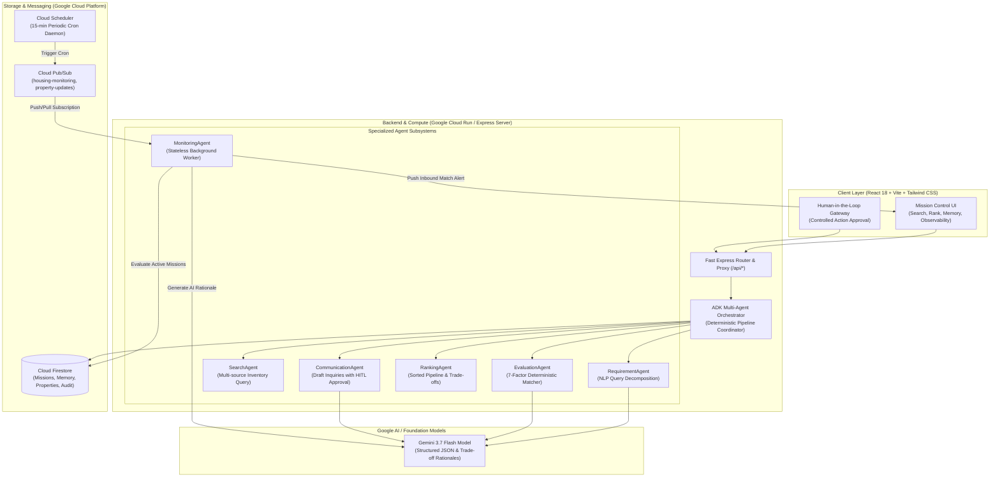

# Agentic Housing Navigator — System Architecture

The **Agentic Housing Navigator** is an autonomous, multi-agent real estate finding system built on Google Cloud, the Google Agent Development Kit (ADK), and Gemini 3.7 Flash.

---

## 1. High-Level Architecture Overview

---

## 2. End-to-End Data Flow

### 2.1 Mission Creation & Understanding
1. **User Prompt**: The user provides an unstructured natural language search query (e.g., *"Looking for a 2BHK flat near Koramangala with power backup and high floor, max ₹22,000 rent, move in next week"*).
2. **Context Enrichment**: The system queries Cloud Firestore memory for existing tenant preferences (e.g., floor preferences, pet requirements).
3. **Gemini NLP Decomposition**: `RequirementAgent` invokes Gemini 3.7 Flash with a strict schema to extract 7 core parameters:
   - Property type & bedroom count
   - Minimum & maximum budget constraints
   - Geographic target locality & maximum radius (km)
   - Furnishing requirements & availability dates
   - Required amenities (Power Backup, Lift, Wi-Fi, Security)
   - Floor constraints (e.g., Avoid Ground Floor) and tenant profile

### 2.2 Property Search & 7-Factor Deterministic Ranking
1. **Inventory Query**: `SearchAgent` filters the property collection based on hard boundary criteria (budget tolerance, bedroom count, location radius).
2. **Deterministic Scoring**: `EvaluationAgent` processes each candidate through a weighted mathematical scoring engine:
   - **Budget Fit (30 pts)**: Penalizes over-budget properties with continuous decay; rewards under-budget savings.
   - **Location Distance (25 pts)**: Euclidean / Haversine distance decay from the target campus or office.
   - **Property Type Alignment (15 pts)**: Exact or compatible category match.
   - **Bedroom Match (10 pts)**: Configuration parity.
   - **Furnishing Status (10 pts)**: Alignment with required furnishing.
   - **Move-In Availability (5 pts)**: Immediate or requested window readiness.
   - **Amenities & Inclusions (5 pts)**: Power backup, lift, parking, and security checklist.
3. **AI Recommendation Rationales**: For candidates scoring $>85\%$, Gemini 3.7 Flash generates human-readable trade-off breakdowns without exposing chain-of-thought tokens:
   - Why selected
   - What matched
   - What did not match
   - Key trade-offs
   - Estimated total monthly cost

### 2.3 Human-in-the-Loop Controlled Action Workflow
1. When a user requests external outreach (e.g., contacting a verified property owner or scheduling a physical viewing), `CommunicationAgent` drafts the inquiry.
2. The agent pauses execution and displays **"Agent Action Requires Approval"** in the UI.
3. The user can **Approve**, **Edit**, or **Reject** the proposed communication.
4. No external messages or state modifications are dispatched without explicit user confirmation.

### 2.4 Asynchronous Background Monitoring (Event-Driven)
1. **Cloud Scheduler**: Dispatches cron heartbeats every 15 minutes (`*/15 * * * *`) to Google Cloud Pub/Sub.
2. **Cloud Pub/Sub Topics**:
   - `housing-monitoring`: Evaluates active missions against current market listings.
   - `property-updates`: Ingests newly posted properties from feed connectors.
   - `agent-events`: Publishes telemetry and audit logs.
3. **Cloud Run Monitoring Worker**:
   - Stateless background worker receives Pub/Sub push messages.
   - Queries active missions from Firestore.
   - Evaluates candidate properties with idempotency tracking to avoid duplicate notifications.
   - Writes new high-match records ($>85\%$) to Firestore notifications.
   - Dispatches in-app match alerts to the user.

---

## 3. Observability & Security

### 3.1 Agent Observability
- **Trace Spans**: Every agent execution logs `missionId`, `agent`, `taskName`, `status`, `timestamp`, `executionDurationMs`, `retryCount`, and sanitized payload data.
- **Privacy Assurance**: Sensitive API tokens, passwords, and private identifiers are scrubbed from telemetry outputs before visualization or JSON export.

### 3.2 Security Posture
- **Server-Side API Proxying**: Gemini API keys and cloud credentials reside strictly server-side in Cloud Run environment variables (`GEMINI_API_KEY`).
- **Input Validation**: All incoming mission parameters and filter states undergo schema verification before agent processing.
- **Fail-Safe Fallbacks**: Deterministic mathematical fallbacks operate continuously even during upstream model rate-limiting or network partition events.
